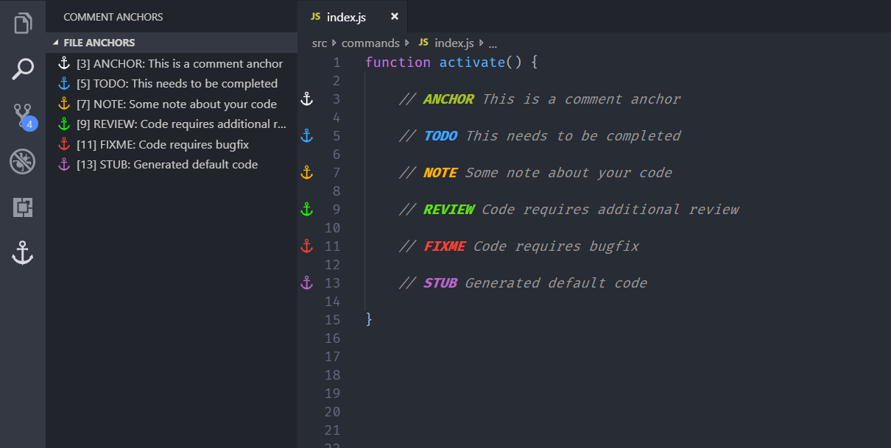
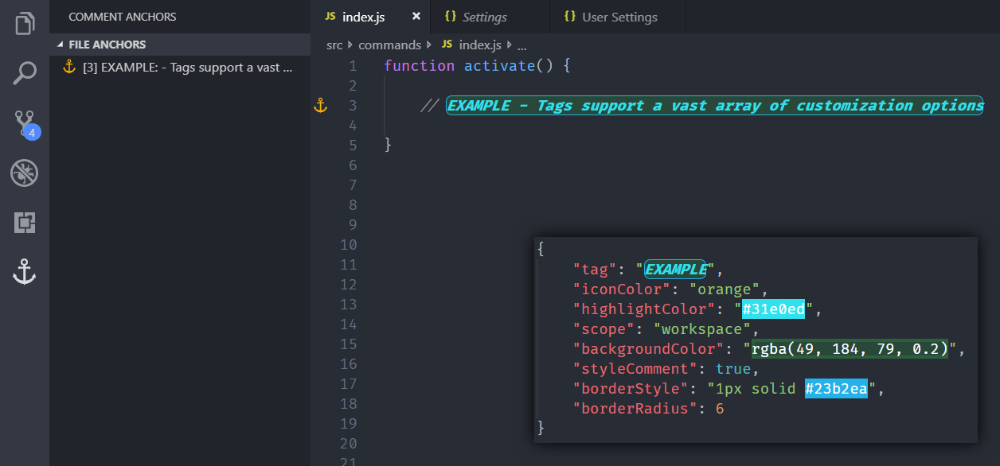

# Comment Anchors

Place anchors within comments or strings to place bookmarks within the context of your code. Anchors can be used to track TODOs, Notes, or to build a simple navigation, making it easier to navigate large files.

Anchors can be viewed for the current file, or throughout the entire workspace, using an easy to use sidebar.

Comment Anchors provides many configuration options, allowing you to tailor this extension to your personal workflow, and increase productivity.

## Changelog
View the changelog [here](CHANGELOG.md)

## Features

* Place anchors in comments, strings, documentation, etc.
* Anchors can be viewed in the anchor sidebar view in the activity bar.
* Anchor names, icon colors, highlight colors, and much more can be customized. (See below for examples)
* Click an anchor in the sidebar view to scroll it into view. 
* Quickly toggle tag visiblity with commands
* View anchors across your entire workspace
* Scope anchors to be visible in your entire workspace, or just the current file

## Usage

The default settings come with anchors for the following tags:

* ANCHOR - Used to indicate a section in your file
* TODO - An item that is awaiting competion
* FIXME - An item that requires a bugfix
* STUB - Used for generated default snippets
* NOTE - An important note for a specific code section
* REVIEW - An item that needs additional review

_(NOTE: These default tags are an example, and do not add any further functionality)_

In order to make an anchor, simply place the tag name in a comment, with an additional anchor message behind it. The anchor will be automatically detected and added to the Anchor List in the activity sidebar.


## Anchor types

All anchor types have their own icon, highlight color, and background color, and more, which can all be customized in the settings. Anchor tags can be added and removed, and can share the same icon or color.



## Workspace anchors

Besides displaying anchors found in the current file, the sidebar also displays a list of
tags it found across all files in your workspace. These anchors are displayed per file, and can
be used as quick navigation.

The visibility of anchor tags in the workspace list can be altered using the 'scope' property on each tag (See configuration section).


## Tag customization

Comment Anchors supports a vast range of tag customization options. All tags can be modified, including the default tags. This allows you to define tags useful for your workflow.

See the configuration section for a complete list of tag properties.



## Configuration

Use `commentAnchors.parseDelay` to alter the delay in milliseconds between when you stop with typing and when the anchor parser starts. Increasing this value can result in better performance. (Default 200)

```
{
	"commentAnchors.parseDelay": 200
}
```

Use `commentAnchors.tagHighlights.enabled` to set whether tags are highlighted. (Default true)

```
{
	"commentAnchors.tagHighlights.enabled": true
}
```

Use `commentAnchors.workspace.matchFiles` to define which files are scanned by Comment Anchors. This setting can be used to greatly increase performance in your projects, as by default most files are scanned.

```
{
	"commentAnchors.workspace.matchFiles": "**/*"
}
```

Use `commentAnchors.workspace.excludeFiles` to define which files are excluded from being scanned by Comment Anchors. This setting can be used to greatly increase performance in your projects, as by default only few directories are excluded.

```
{
	"commentAnchors.workspace.matchFiles": "{node_modules,.git,.idea}/**/*"
}
```

Use `commentAnchors.tags.displayInSidebar` to set whether tags are included in the sidebar list. (Default true)

```
{
	"commentAnchors.tags.displayInSidebar": true
}
```

Use `commentAnchors.tags.displayInGutter` to set whether gutter icons are shown. (Default true)

```
{
	"commentAnchors.tags.displayInGutter": true
}
```

Use `commentAnchors.tags` to configure the anchor tags. Below is a list of properties each tag can have.

**Required properties:**
- tag - *Specifies the name of the tag*
- scope - *The scope of a tag. Specifying "file" will only make these visible in the 'File Anchors' list*
- iconColor - *The color used for the icon*
- highlightColor - *The color used for highlighting the tag*

**Optional properties:**
- backgroundColor - *The color used as tag background*
- styleComment - *Boolean indicating whether to style the entire comment, or just the tag*
- borderStyle - *Style to be applied to the tag border (See https://www.w3schools.com/cssref/pr_border.asp)*
- borderRadius - *The curvature radius of the border (Requires borderStyle)*
- isBold - *Whether to apply bold formatting to the tag*
- isItalic - *Whether to apply italicized formatting to the tag*

```
"commentAnchors.tags": [
	{
		"tag": "ANCHOR",
		"scope": "file",
		"iconColor": "default",
		"highlightColor": "#A8C023",
		"styleComment": true
	}
]
```

## Tag themes

### Neon

In case you prefer backgrounds on all tags, here is an example setup using background colors. Simply use this JSON as the `commentAnchors.tags` configuration to use.

```
[
	{"tag": "ANCHOR", "iconColor": "default", "highlightColor": "#A8C023", "backgroundColor": "#49511d", "scope": "file"},
	{"tag": "TODO", "iconColor": "blue", "highlightColor": "#3ea8ff", "backgroundColor": "#0052a5", "scope": "workspace"},
	{"tag": "FIXME", "iconColor": "red", "highlightColor": "#F44336", "backgroundColor": "#592c2c", "scope": "workspace"},
	{"tag": "STUB", "iconColor": "purple", "highlightColor": "#BA68C8", "backgroundColor": "#48309a", "scope": "file"},
	{"tag": "NOTE", "iconColor": "orange", "highlightColor": "#FFB300", "backgroundColor": "#806900", "scope": "file"},
	{"tag": "REVIEW", "iconColor": "orange", "highlightColor": "#64DD17", "backgroundColor": "#3c7c10", "scope": "workspace"}
]
```

## Issues

Found a problem or missing feature in Comment Anchors?
Issues and suggestions can be submitted in the GitHub repository [here](https://github.com/ExodiusStudios/vscode-comment-anchors/issues)

### Bad performance?

Comment Anchor scans your entire workspace for tags. This can cause bad performance when your
workspace contains many files, such as dependency directories and logfiles. It is therefore advised to alter the `matchFiles` and `excludeFiles` settings to limit the amount of directories and files scanned.

## Contribution

You can contribute to comment-anchors by forking the GitHub [repository](https://github.com/ExodiusStudios/vscode-comment-anchors) and submitting pull requests.

#### Thanks for using Comment Anchors! ❤️