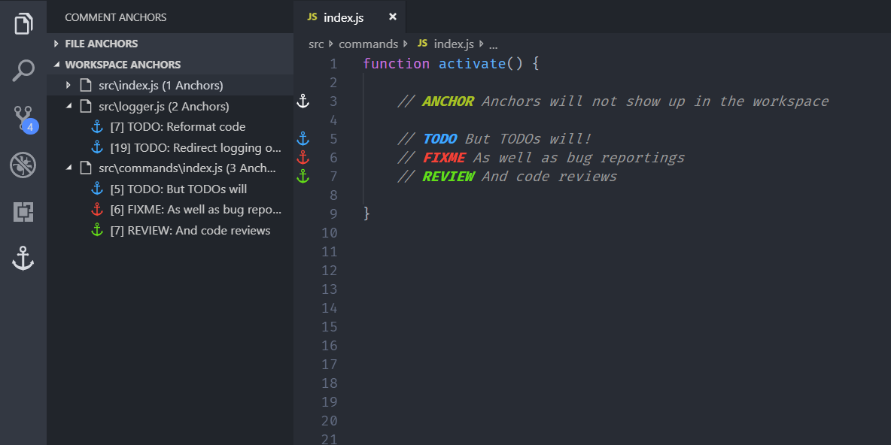
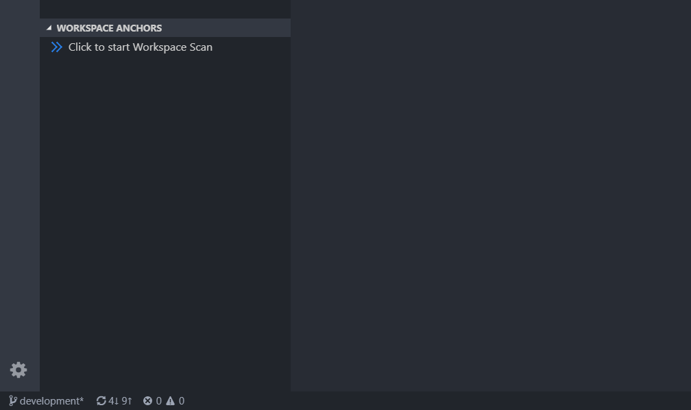
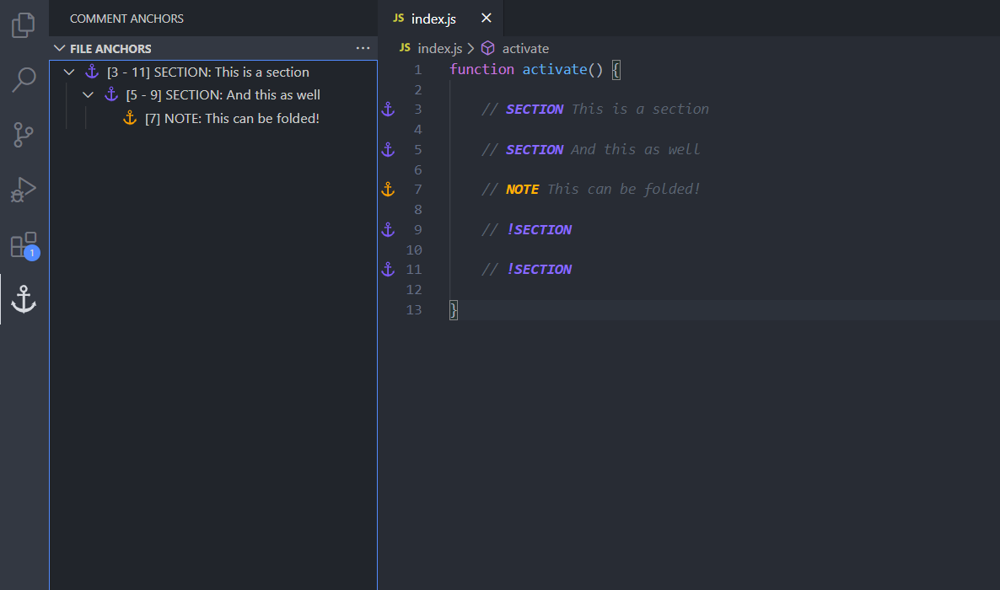
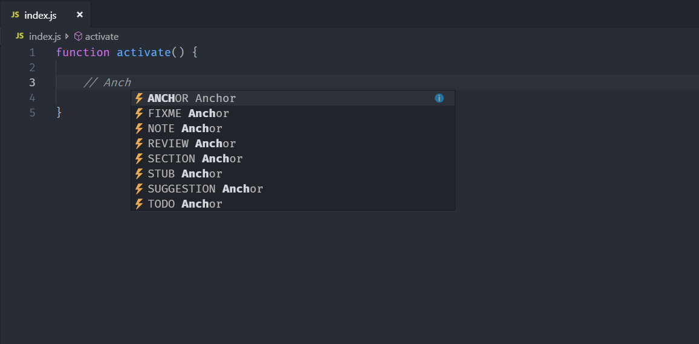

Place anchors within comments or strings to place bookmarks within the context of your code. Anchors can be used to track TODOs, write notes, create foldable sections, or to build a simple navigation making it easier to navigate your files.

Anchors can be viewed for the current file, or throughout the entire workspace, using an easy to use sidebar.

Comment Anchors provides many configuration options, allowing you to tailor this extension to your personal workflow, and increase productivity. Check below for a complete list of features!

### Changelog
The changelog can be found [here](CHANGELOG.md)

# Feature breakdown

* Place anchors in any file for any language
* Anchors can be viewed in the anchor list sidebar
* Anchor names, colors, highlight colors, and much more can be customized (See below for examples)
* Click an anchor in the anchor list to scroll it into view
* Quickly toggle tag visibility with commands
* View anchors across your entire workspace
* Scope anchors to be visible in your entire workspace, or just the current file
* Group anchors into logical sections using region anchors

# Usage

The default settings come with anchors for the following tags:

* ANCHOR - Used to indicate a section in your file
* TODO - An item that is awaiting completion
* FIXME - An item that requires a bugfix
* STUB - Used for generated default snippets
* NOTE - An important note for a specific code section
* REVIEW - An item that needs additional review
* SECTION - Used to define a region (See 'Hierarchical anchors')

In order to make an anchor, simply place the tag name in a comment, with an additional anchor message behind it. The anchor will be automatically detected and added to the Anchor List in the activity sidebar.


## Anchor types

All anchor types have their own highlight color, and background color, and more, which can all be customized in the settings. Anchor tags can be added and removed, and can share the same icon or color. You can specify and use any hex color for the highlighting and icons, giving you full control over your personal set of anchor tags.


In case you want to disable one or more default tags, simply set the `enabled` property to `false` (See configuration section).

## Workspace anchors

Besides displaying anchors found in the current file, the sidebar also displays a list of
tags it found across all files in your workspace. These anchors are displayed per file, and can
be used as quick navigation.

The visibility of anchor tags in the workspace list can be altered using the 'scope' property on each tag (See configuration section).



### Lazy loading

Since workspace anchors are usually scanned at startup, this can increase load time for projects containing many
files and folders. In this case you can enable lazy loading mode, which will require an additional manual trigger to start the scan.

Lazy workspace loading can be enabled in the settings (See configuration section).



## Hierarchical anchors
Region Anchors allow you to group relevant Comment Anchors together in regions, which can be
folded within the anchor sidebar. These anchors act nearly identical to regular anchors,
however they require an end tag to be specified, which is simply a tag of the same type, prefixed with an exclamation mark.



In order to mark a tag as Region Tag, set the `isRegion` property to `true` in the tags configuration (See configuration section).

A default region tag is provided, called "SECTION"

## Tag customization

Comment Anchors supports a vast range of tag customization options. All tags can be modified, including the default tags. This allows you to define tags useful for your workflow.

See the configuration section for a complete list of tag properties.


## IntelliSense support

Comment Anchors can be autocompleted by IntelliSense.



# Commands

\> **List configured anchor tags**

Displays all configured tags in a preview tab, useful for when you are creating your own tags.

\> **Toggle the visibility of comment anchors**

Toggles the visibility of comment anchors (Duh!). Note that his command will update your settings in order to toggle the visibility.

# Configuration

Use `commentAnchors.parseDelay` to alter the delay in milliseconds between when you stop with typing and when the anchor parser starts. Increasing this value can result in better performance. (Default 200)

```
{
	"commentAnchors.parseDelay": 200
}
```

Use `commentAnchors.scrollPosition` to alter where to position the anchor when scrolled to (Default top)

```
{
	"commentAnchors.scrollPosition": "top"
}
```

Use `commentAnchors.tagHighlights.enabled` to set whether tags are highlighted. (Default true)

```
{
	"commentAnchors.tagHighlights.enabled": true
}
```

Use `commentAnchors.workspace.enabled` to activate workspace wide anchor scanning. This will list out all files containing comment anchors in the "Workspace Anchors" view. (Default true)

```
{
	"commentAnchors.workspace.enabled": true
}
```

Use `commentAnchors.workspace.lazyLoad` to delay the loading of workspace anchors until a manual confirmation is given. It is discouraged
to disable this setting for large workspaces. (Default true)

```
{
	"commentAnchors.workspace.lazyLoad": true
}
```

Use `commentAnchors.workspace.maxFiles` to change how many workspace files will be indexed and displayed in the workspace anchors list. (Default 50) 

```
{
	"commentAnchors.workspace.maxFiles": 50
}
```

Use `commentAnchors.workspace.matchFiles` to define which files are scanned by Comment Anchors. This setting can be used to greatly increase performance in your projects, as by default most files are scanned.

```
{
	"commentAnchors.workspace.matchFiles": "**/*"
}
```

Use `commentAnchors.workspace.excludeFiles` to define which files are excluded from being scanned by Comment Anchors. This setting can be used to greatly increase performance in your projects, as by default only few directories are excluded.

```
{
	"commentAnchors.workspace.excludeFiles": "**/{node_modules,.git,.idea,target,out,build,vendor}/**/*"
}
```

Use `commentAnchors.workspace.pathFormat` to change the way paths are displayed in the workspace anchor tree. You can choose to display full paths, abbreviate folders to single characters, or to hide the path completely. (Default full)

```
{
	"commentAnchors.workspace.pathFormat": "full"
}
```

Use `commentAnchors.tags.provideAutoCompletion` to enable autocompletion support for anchor tags. (Default true)

```
{
	"commentAnchors.tags.provideAutoCompletion": true
}
```

Use `commentAnchors.tags.displayInSidebar` to set whether tags are included in the sidebar list. (Default true)

```
{
	"commentAnchors.tags.displayInSidebar": true
}
```

Use `commentAnchors.tags.displayInGutter` to set whether gutter icons are shown. (Default true)

```
{
	"commentAnchors.tags.displayInGutter": true
}
```

Use `commentAnchors.tags.displayInRuler` to set whether icons are represented by colored bars in the scrollbar ruler. (Default true)

```
{
	"commentAnchors.tags.displayInRuler": true
}
```

Use `commentAnchors.tags.displayLineNumber` to set whether line numbers are displayed in the sidebar (Default true)

```
{
	"commentAnchors.tags.displayLineNumber": true
}
```

Use `commentAnchors.tags.rulerStyle` to set the appearance in the overview ruler (Default "center")

```
{
	"commentAnchors.tags.rulerStyle": "center"
}
```

Use `commentAnchors.tags.sortMethod` to set the method used to sort anchors by in the sidebar list. Set this to "line" to sort by line number (Default), or "type" to sort by tag type.

```
{
	"commentAnchors.tags.sortMethod": "line"
}
```

Use `commentAnchors.tags.separators` to set the list of accepted separators

```
{
	"commentAnchors.tags.separators": [
		" ",
		": ",
		" - "
	]
}
```

Use `commentAnchors.tags.list` to configure the anchor tags. Below is a list of properties each tag can have.

Use `commentAnchors.epic.provideAutoCompletion` to enable autocompletion support for epic. (Default true)

```
{
	"commentAnchors.epic.provideAutoCompletion": true
}
```

Use `commentAnchors.epic.seqStep` to config how much should auto-completion-item add on current max-seq. (Default 1)

```
{
	"commentAnchors.epic.seqStep": 1
}
```


**Required properties:**
- tag - *Specifies the name of the tag*
- scope - *The scope of a tag. Specifying "file" will only make these visible in the 'File Anchors' list*
- highlightColor - *The color used for highlighting the tag*

**Optional properties:**
- backgroundColor - *The color used as tag background*
- iconColor - *An optional color to apply to the icon, or "auto" for automatic theme detection. Defaults to using highlightColor*
- styleComment - *Boolean indicating whether to style the entire comment, or just the tag*
- borderStyle - *Style to be applied to the tag border (See https://www.w3schools.com/cssref/pr_border.asp)*
- borderRadius - *The curvature radius of the border (Requires borderStyle)*
- isBold - *Whether to apply bold formatting to the tag*
- isItalic - *Whether to apply italicized formatting to the tag*
- isRegion - *Mark this anchor as a region anchor*
- enabled - *Allows the disabling of default (and custom) tags*

```
"commentAnchors.tags.list": [
	{
		"tag": "ANCHOR",
		"scope": "file",
		"iconColor": "default",
		"highlightColor": "#A8C023",
		"styleComment": true
	},
	...
]
```

You can use the `enabled` property to disable one or more default tags like so:

```
"commentAnchors.tags.list": [
	{
		"tag": "NOTE",
		"enabled": false
	},
	...
]
```

## Icon colors
At startup, anchor icons are generated for all colors specified on your tags. The icon color defaults to using the tags `highlightColor`,
however a custom color may be specified with `iconColor`. Setting `iconColor` to `auto` will allow VSCode to pick an icon based on your
currentl theme (black or white).

Besides specifying a custom hex color, the following names may be used as shortcuts.

| Color         | Hex     |
| :------------ |--------:|
| blue          | #3ea8ff |
| blurple       | #7d5afc |
| red           | #F44336 |
| purple        | #BA68C8 |
| teal          | #00cec9 |
| orange        | #ffa100 |
| green         | #64DD17 |
| pink          | #e84393 |
| emerald       | #2ecc71 |
| yellow        | #f4d13d |

# Issues

Found a problem or missing feature in Comment Anchors?
Issues and suggestions can be submitted in the GitHub repository [here](https://github.com/ExodiusStudios/vscode-comment-anchors/issues)

If you prefer more direct help, you can join the [Exodius Studios Discord](https://discord.gg/exaQDX2) where you can find most developers of this extension.

## Poor performance?

Comment Anchor scans your entire workspace for tags. This can cause bad performance when your
workspace contains many files, such as dependency directories and logfiles. It is therefore advised to alter the `matchFiles` and `excludeFiles` settings to limit the amount of directories and files scanned.

If you'd rather disable workspace anchors all together, you can disable these in the settings.

# Contribution

You can contribute to comment-anchors by forking the GitHub [repository](https://github.com/ExodiusStudios/vscode-comment-anchors) and submitting pull requests.

### **Thanks for using Comment Anchors! ❤️**
